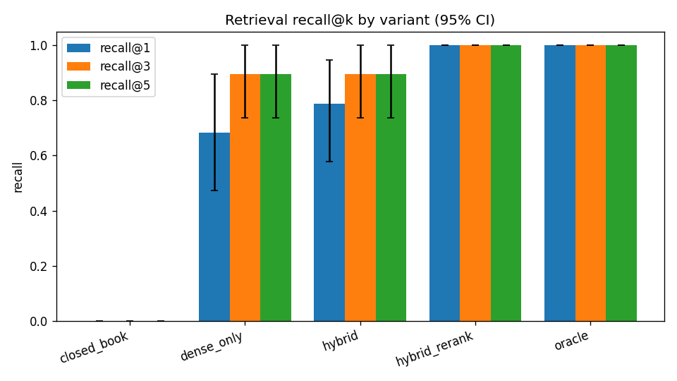
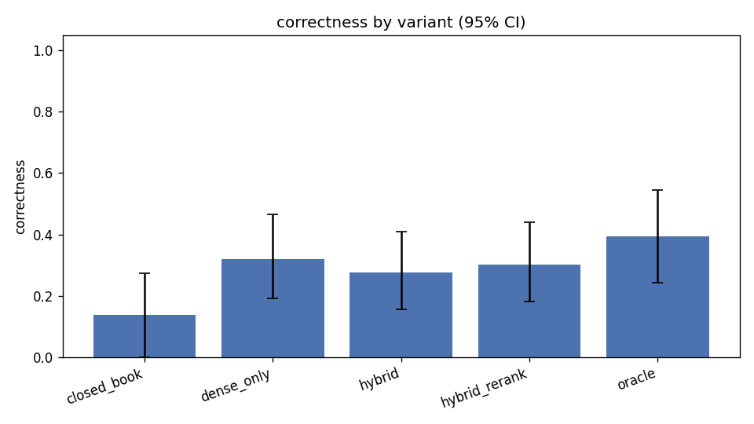

# rag-eval-engine

[](https://github.com/DheerajRam12262/rag-eval-engine/actions/workflows/ci.yml)
[](https://www.python.org/)
[](https://mypy-lang.org/)
[](https://github.com/psf/black)
[](LICENSE)

> Most RAG systems are *demoed*, not *measured*. **rag-eval-engine** is a hybrid-retrieval RAG
> service over a non-trivial corpus with a rigorous, reproducible **evaluation harness** that
> quantifies retrieval quality, answer faithfulness, latency, and cost — and **gates regressions
> in CI**.

The differentiator is the eval harness: bootstrap confidence intervals, paired significance
tests, a validated LLM-as-judge, and baselines (closed-book + oracle) that *prove* retrieval adds
value rather than assuming it.

> **Status:** all build phases complete — ingestion, hybrid retrieval, grounded generation,
> the eval harness, FastAPI serving, Docker, and a CI regression gate all run end to end on the
> deterministic offline backend (no GPU, no API key). 90+ tests, `mypy --strict` clean.

## Architecture

```
                          INGESTION (offline)
  corpus ──▶ chunker ──▶ embeddings ──▶ vector store (dense)
                   └───▶ BM25 index (sparse)

                          QUERY PATH (online)
  query ──▶ hybrid retrieve (BM25 + dense) ──▶ RRF fusion ──▶ cross-encoder rerank
        ──▶ context assembly ──▶ LLM generate ──▶ answer + citations
        (every stage emits latency + token/cost telemetry)

                          EVAL PATH (the centerpiece)
  gold set ──▶ run variant ──▶ metrics ──▶ results store ──▶ bootstrap CIs + significance
           ──▶ ablation table + plots ──▶ CI regression gate
```

### Runs offline by default
Every component that normally needs a GPU or an API key (embedder, vector store, generator,
judge) has a **real, deterministic offline reference implementation**, with production adapters
(sentence-transformers, Qdrant, Anthropic/OpenAI) behind optional installs. So the full pipeline
and eval harness run — and are tested in CI — with **no GPU and no API key**. See
[docs/DECISIONS.md](docs/DECISIONS.md).

## Results

Ablation on the committed sample corpus, **test split (n=22)**, deterministic offline backend.
Cells are means; full 95% bootstrap CIs are in [eval/results/ablation.md](eval/results/ablation.md)
and the figures in [eval/results/](eval/results/). Reproduce with `make repro`.

| variant | recall@1 | recall@3 | recall@5 | nDCG@5 | MRR | faithfulness | correctness | abstention |
|---|---|---|---|---|---|---|---|---|
| `closed_book` (no retrieval) | 0.00 | 0.00 | 0.00 | 0.00 | 0.00 | n/a | 0.14 | 0.14 |
| `dense_only` | 0.68 | 0.90 | 0.90 | 0.82 | 0.80 | 1.00 | 0.32 | 0.95 |
| `hybrid` (BM25+dense, RRF) | 0.79 | 0.90 | 0.90 | 0.86 | 0.86 | 1.00 | 0.28 | 0.91 |
| `hybrid_rerank` | **1.00** | **1.00** | **1.00** | **1.00** | **1.00** | 1.00 | 0.30 | 0.91 |
| `oracle` (gold context) | 1.00 | 1.00 | 1.00 | 1.00 | 1.00 | 1.00 | **0.39** | 1.00 |

**Significance (paired bootstrap, per-question):**
- `hybrid_rerank` beats `dense_only` on **recall@1: +0.316, p = 0.001** — reranking is doing real work.
- retrieval vs `closed_book` on **recall@5: +1.000, p < 0.001** — retrieval, not parametric memory, supplies the evidence.

**What the baselines reveal (the point of including them):**
1. **Retrieval is essential.** `closed_book` (no retrieval) scores ~0 on every retrieval metric and
   0.14 correctness; any retrieval variant clears it decisively.
2. **Rerank improves ranking** — `hybrid_rerank` significantly lifts recall@1 over `dense_only`.
3. **The generator is the bottleneck, not retrieval.** Correctness is flat (~0.30) across retrieval
   variants and the `oracle` ceiling is only 0.39 — even with perfect context the *extractive* offline
   generator can't do better. That's the cue to spend on generation (swap in the Anthropic backend),
   not more retrieval. Surfacing this is exactly why the oracle baseline exists.




> The offline backend is a deterministic *lexical* proxy chosen for reproducibility. The harness is
> identical with real backends; semantic embeddings (`bge`) on a larger, noisier corpus would widen
> the dense/hybrid gaps. See [docs/DECISIONS.md](docs/DECISIONS.md).

## How to run

```bash
make install        # venv + pinned deps (editable, with dev extras)
make ci             # ruff + black --check + mypy + pytest (what CI runs)
make ingest         # build dense + BM25 indexes from the sample corpus
make eval           # run the eval harness for one config
make repro          # rebuild indexes and reproduce the ablation table + plots
make smoke-eval     # the CI regression gate (fails if key metrics regress)
make serve          # FastAPI service on :8000  (try POST /query)
```

Or in Docker: `docker compose up --build` then `curl localhost:8000/health`.

Optional production backends:

```bash
pip install -e ".[embeddings]"   # sentence-transformers + torch
pip install -e ".[qdrant]"       # qdrant-client
pip install -e ".[llm]"          # anthropic + openai
```

Copy `.env.example` to `.env` to point at real backends. Nothing in `.env` is required for the
default offline path.

## Limitations
- The offline reference implementations (hashing embedder, lexical reranker/judge) are
  deterministic *proxies* chosen for reproducibility, not state-of-the-art quality. Headline
  quality numbers in a real deployment use the API/model backends; the harness is identical.
- The in-memory vector store does **exact** nearest-neighbor (O(N·d)); production uses ANN.
  "What changes at 10M docs" is documented in [docs/DECISIONS.md](docs/DECISIONS.md).

## Project docs
- [docs/PROJECT_PLAN.md](docs/PROJECT_PLAN.md) — architecture, build plan, definition of done.
- [docs/DECISIONS.md](docs/DECISIONS.md) — design decisions, tradeoffs, and "what changes at 100×".

## License
MIT.
